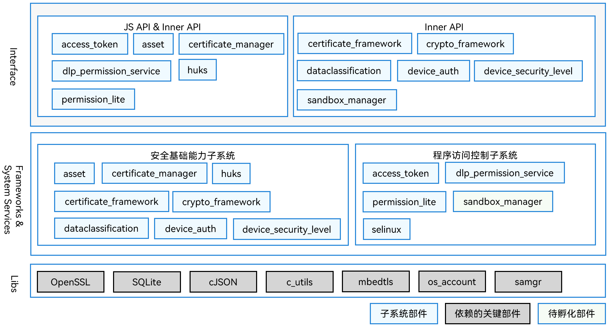

# SIG_Security
简体中文 | [English](./sig_security.md)

说明：本SIG的内容遵循OpenHarmony的PMC管理章程 [README](../../zh/pmc.md)中描述的约定。

## SIG组工作目标和范围

### 工作目标
OpenHarmony安全业务的开发规划

### 工作范围
OpenHarmony安全业务,包括应用权限、应用签名、设备认证和密钥管理等

安全SIG（ sig_security ）架构全景图如下图所示：

## SIG组成员

### Leader
- @niejiteng(https://gitee.com/niejiteng)

### Committers列表
- @wangkairong(https://gitee.com/wkr321_ent)
- @liuhanxiong(https://gitee.com/liuhanxiong)
- @haixiangw(https://gitee.com/haixiangw)
- @chennian1(https://gitee.com/chennian1121)

### 会议
 - 会议时间：双周例会，周一晚上19:15，UTC+8
 - 会议申报：[OpenHarmony sig_Security Meeting Proposal](https://shimo.im/sheets/g69CCHwg3QhTDVQc/MODOC)
 - 会议链接: Welink或其他会议
 - 会议通知: 请[订阅](https://lists.openatom.io/postorius/lists/dev.openharmony.io)邮件列表 dev@openharmony.io 获取会议链接
 - 会议纪要: [归档链接地址](https://gitcode.com/openharmony-sig/sig-content)

### 联系方式(可选)

- 邮件列表：dev@openharmony.io
- 微信群：xxx
