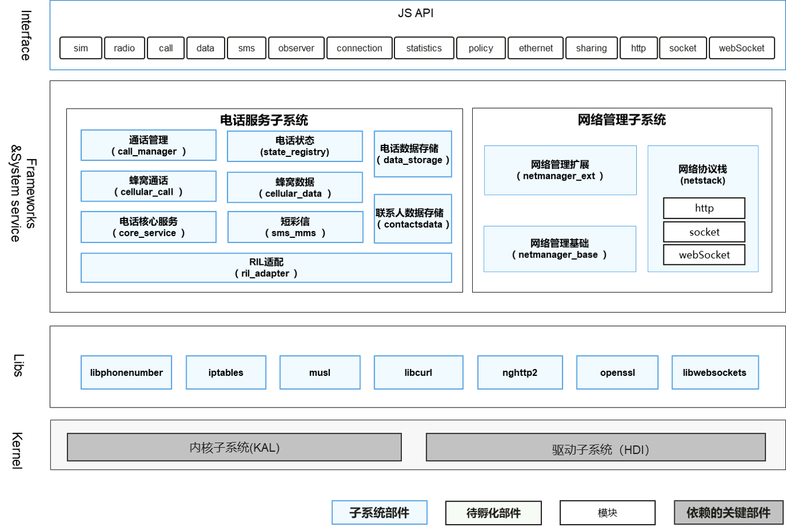

# sig_Telephony
简体中文 | [English](./sig_telephony.md)

说明：本SIG的内容遵循OpenHarmony的PMC管理章程 [README](../../zh/pmc.md)中描述的约定。

## SIG组工作目标和范围

### 工作目标
- 提供SIM卡、搜网、蜂窝数据、蜂窝通话、短彩信等蜂窝移动网络基础通信能力，可管理多类型通话和数据网络连接，为应用开发者提供便捷一致的通信API。

### 工作范围
- 核心服务模块：主要功能是初始化RIL管理、SIM卡和搜网模块。
- 通话管理模块：主要功能是管理CS（Circuit Switch，电路交换）、IMS（IP Multimedia Subsystem，IP多媒体子系统）和OTT（over the top，OTT解决方案）三种类型的通话，申请通话所需要
- 的音视频资源，处理多路通话时产生的各种冲突。
- 蜂窝通话模块：主要功能是实现基于运营商网络的基础通话。
- 短彩信模块：主要功能是短信收发和彩信编解码。
- 状态注册模块：主要功能是提供电话服务子系统各种消息事件的订阅以及取消订阅的API。

通信框架SIG（ sig_telephony ）技术栈范围全景图如下图所示：

## 代码仓
|部件名称|部件功能描述|部件仓名称|
| ------------ | ------------ |------------ |
|通话管理|提供不同类型通话（CS/IMS/OTT）的音频通道、优先级等冲突策略管理，提供通话管理相关API供应用使用。包括：拨打电话、来电接听/挂断/拒接、三方通话控制、获取/订阅通话状态、通话静音控制、IMS通话开关控制、号码格式化、紧急呼叫号码判断。|telephony_call_manager|
|电话状态|提供蜂窝电话相关状态订阅功能，包括：网络注册状态、信号强度、小区信息、蜂窝数据连接状态、蜂窝数据上下行状态、通话状态、卡状态。|telephony_state_registry|
|蜂窝通话|提供运营商通话基础能力（CS&IMS通话），支持CS和IMS通话之间的域选控制和切换，支持紧急通话。其中，IMS通话仅支持框架，服务实现由芯片厂商自行实现。|telephony_cellular_call|
|蜂窝数据|提供蜂窝数据联网能力，包括：蜂窝数据激活去激活、连接状态管理、数据自愈、APN管理、蜂窝数据开关及数据漫游开关。|telephony_cellular_data|
|短彩信|提供短彩信、小区广播能力，包括：短信收发、短信PDU编解码、WAP PUSH、彩信通知、彩信编解码、小区广播、SIM卡短信。|telephony_sms_mms|
|电话数据存储|提供卡账户、随卡参数、APN、短彩信数据的持久化存储功能，通过DataAbility提供增删改查接口。|telephony_telephony_data|
|联系人数据存储|提供联系人、通话记录、语音信箱数据的持久化存储功能，通过DataAbility提供增删改查接口。|applications_contacts|
|电话核心服务|提供SIM卡、搜网基础能力，通过HDF与RIL Adapter进行通信，通过发布订阅机制实现与各功能模块的通信。|telephony_core_service|
|RIL适配|蜂窝通信RIL接口适配层，提供统一的南向HDI接口，屏蔽不同modem厂商硬件差异，包括：SIM卡、搜网、通话、数据、短信和公共模块。|telephony_ril_adapter|
|网络管理基础|提供网络管理基础能力，包括：多网络连接切换与并发、网络连接信息查询、网络连接状态查询订阅、网络质量检测、策略管理、流量统计。|communication_netmanager_base|
|网络管理扩展|提供网络管理扩展能力，包括：以太网连接、网络共享、VPN、加密DNS、mDNS。|communication_netmanager_ext|
|电话核心服务|提供基础网络协议栈JS API能力，包括：HTTP/HTTPS、TCP/UDP/TLS Socket、WebSocket、LocalSocket。|communication_netstack|

## SIG组成员

### Leader
- @zhang-hai-feng (https://gitee.com/zhang-hai-feng)

### Committers列表
- @zhang-hai-feng (https://gitee.com/zhang-hai-feng)
- @jiayanhong-hw (https://gitee.com/jiayanhong-hw)
- @clevercong (https://gitee.com/clevercong)
- @ohos-lsw (https://gitee.com/ohos-lsw)
- @xautosoft (https://gitee.com/xautosoft)
- @hwlitao (https://gitee.com/hwlitao)

### 会议
 - 会议时间：双周例会 周四下午16:00-17:00
 - 会议申报：[sig_telephony Meeting Proposal](https://shimo.im/sheets/wgwGRwc9KCYH6Txv/MODOC)
 - 会议链接: Welink或其他会议
 - 会议通知: 请[订阅](https://lists.openatom.io/postorius/lists/dev.openharmony.io)邮件列表 dev@openharmony.io 获取会议链接
 - 会议纪要: [归档链接地址](https://gitee.com/openharmony-sig/sig-content)

### 联系方式(可选)

- 邮件列表：dev@openharmony.io
- 微信群：NA
