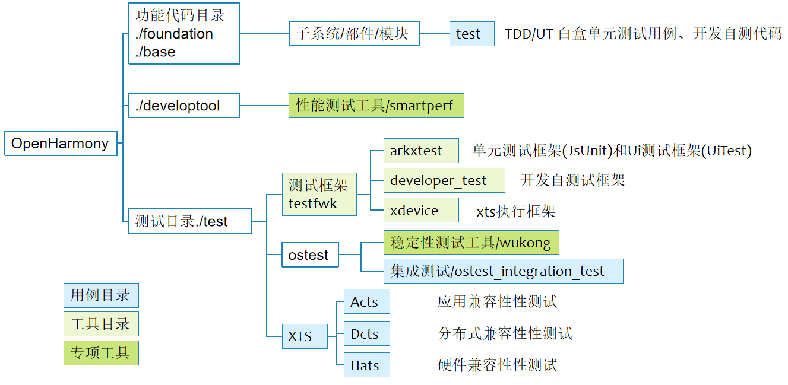
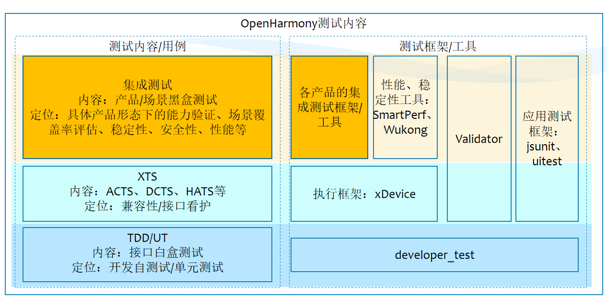

# sig_Test

简体中文 | [English](./sig_test.md)

说明：本SIG的内容遵循OpenHarmony的PMC管理章程 [README](../../zh/pmc.md)中描述的约定。

## SIG组工作目标和范围

### 工作目标
​     完善OpenHarmony开发测试能力，提供包括单元测试、性能测试等在内的多种测试类型，提升测试框架易用性。

### 工作范围

- 维护开发测试框架
- 完善开发测试框架中测试类型，为OpenHarmony提供开发自测试能力

Test-SIG（ sig_Test ）技术栈范围全景图如下图所示：

测试仓目录结构如下图所示：

测试内容组成如下图所示：

## 代码仓
| **称**               | **部件功能描述**                                             | **部件仓名称**                                   |
|---------------------| ------------------------------------------------------------ |---------------------------------------------|
| 测试框架arkXtest        | OpenHarmony自动化测试框架代码部件仓arkXtest，包含单元测试框架(JsUnit)和Ui测试框架(UiTest)。 | arkXtest                                    |
| 稳定性测试工具wukong       | 稳定性测试工具，支持：控件随机注入、基础注入、录制回放能力、可视化工具、可视化报告功能 | wukong                                      |
| 性能功耗测试工具smartperf   | 支持FPS、功耗、热、Soc信息的实时采集、实时展示、数据报告生成 | developtools_profiler/host/smartperf/client |
| 自测试框架developer_test | OpenHarmony为开发者提供了一套全面的自测试框架，开发者可根据测试需求开发相关测试用例，开发阶段提前发现缺陷，大幅提高代码质量 | test_developertest                          |
| 测试调度框架test_xdevice  | xdevice是OpenHarmony中为测试框架的核心组件，提供用例执行所依赖的相关服务 | test_xdevice                                |
| 性能调优工具profiler      | OpenHarmony性能调优分析工具，支持CPU调度、频点、进程线程时间片、堆内存、FPS数据采集和展示。支持在泳道图中展示非实时的采集数据，支持GUI操作数据分析 | developtools_profiler/host/smartperf        |
| 集成测试integration_test       | 集成测试仓用于统一规划、开发、管理操作系统产品化的场景、功能、性能、稳定性、安全性等测试用例。 | test/ostest/ostest_integration_test         |

## SIG组成员

### Leader
- [gaohanyi1982](https://gitee.com/gaohanyi1982)

### Committers列表
- [wangjuntao](https://gitee.com/buranfanchen)
- [NicoYam](https://gitee.com/nicoyam)

### 会议
 - 会议时间：双周例会，待定
 - 会议链接: Welink或其他会议
 - 会议通知: 会议通知: 请[订阅](https://lists.openatom.io/postorius/lists/dev.openharmony.io)邮件列表 dev@openharmony.io 获取会议链接
 - 会议纪要: [归档链接地址](https://gitee.com/openharmony-sig/sig-content)

### 联系方式(可选)

- 邮件列表：dev@openharmony.io

