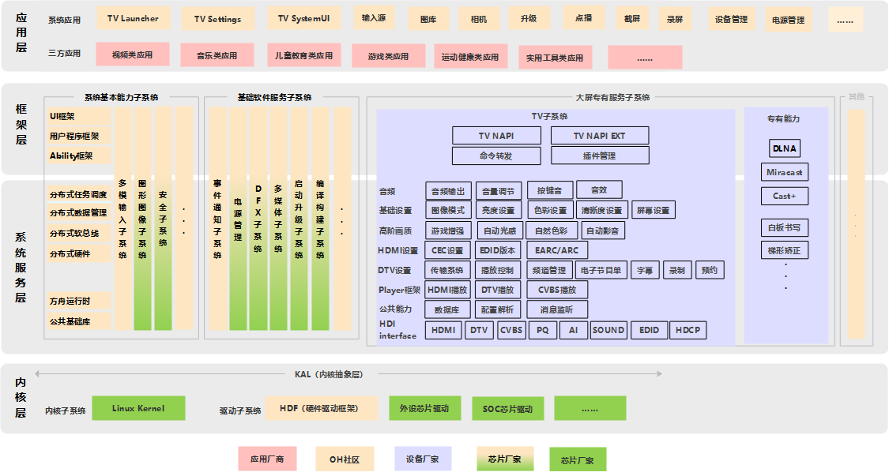

# sig_tv
English | [简体中文](./sig_tv_cn.md)

Note: The content of this SIG follows the convention described in OpenHarmony's PMC Management Charter [README](../../zh/pmc.md).

## SIG group work objectives and scope

### work goals
Build an OpenHarmony large-screen hardware and software public platform to reduce development difficulty and R&D investment through collaborative efforts. Focus on enhancing competitiveness and implementing innovative scenarios to support large-screen industry partners in achieving faster commercial success!

### work scope
 - Collaborate with chip manufacturers to complete chip adaptation and system upgrades based on the OpenHarmony system;
 - Partner with device manufacturers to achieve adaptation of dedicated subsystems for TVs/projectors/set-top boxes based on OpenHarmony, as well as large-screen adaptations for functions such as screen casting, remote control/audio focus, to create competitive products;
 - Work together with application developers to complete large-screen adaptation of third-party applications based on OpenHarmony, and build smooth, user-friendly, and innovative native OpenHarmony applications from aspects of multi-device collaboration and unified interconnection.

 - TV Subsystem Architecture

## SIG Members

### Leader
- @shuguang-wang(https://gitee.com/shuguang-wang)

### Committers
- @tianxudong2(https://gitee.com/tianxudong2)

### Meetings
 - Meeting time：Weekly meeting every Wednesday, from 4:00 PM to 5:30 PM
 - Meeting application: [OpenHarmony TV SIG Meeting Proposal](https://docs.qingque.cn/s/home/eZQD5fEgz0p9aMBiO68_Ymyt0?identityId=2JZgg0BEwbM)
 - Meeting link: Notify via email

### Contact (optional)

- Mailing list：dev@openharmony.io
- Wechat group：NA
