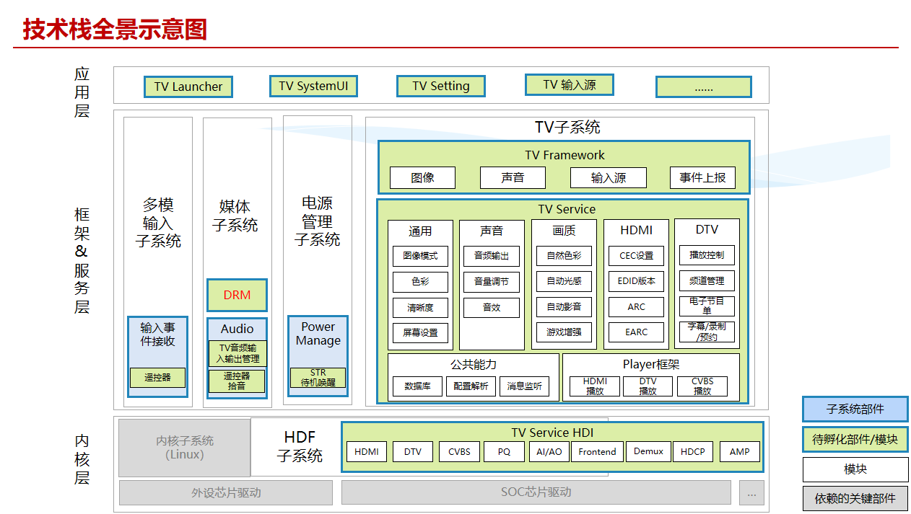
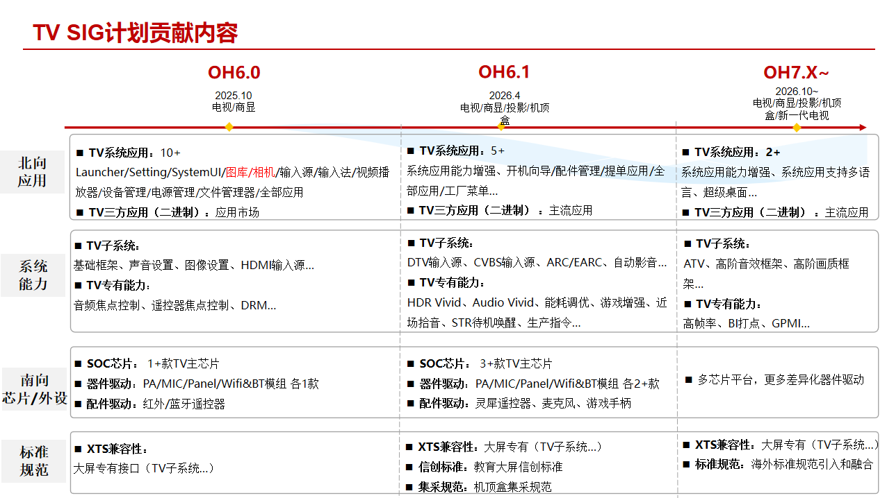

# sig_tv
简体中文 | [English](./sig_tv.md)

说明：本SIG的内容遵循OpenHarmony的PMC管理章程 [README](../../zh/pmc.md)中描述的约定。

## SIG技术栈全景示意图

TV技术栈全景架构图从下到上分为内核层、框架&服务层、应用层
### 内核层
 - 内核子系统（Linux）：基于Linux内核搭建，提供底层运行环境，负责硬件资源管理、进程调度等基础功能。
 - 外设芯片驱动：对接各类外设硬件（如遥控器、音频输出设备等），实现硬件与上层软件的数据交互。
 - SOC芯片驱动：针对电视主控 SOC 芯片开发，协调芯片内部硬件模块（如 CPU、GPU、解码模块等）工作，保障芯片核心功能正常运行。
 - HDF子系统：硬件驱动框架，标准化硬件驱动开发流程，向上层提供统一的硬件访问接口，降低硬件适配复杂度。
### 框架&服务层
#### 多模输入子系统
 - 输入事件接收：负责捕捉用户操作（如遥控器按键、外接设备指令）。
 - 遥控器：解析遥控器按键指令，实现频道切换、音量调节等基础交互。
#### 媒体子系统
 - DRM（数字版权管理）：保障音视频内容版权，加密、解密受保护内容，防止非法复制传播。
 - Audio（音频管理）：涵盖 TV 音频输入输出管理（如外接功放、SPDIF ）、遥控器拾音等。
#### 电源管理子系统
 - Power Manage（电源管理）：控制电视电源状态，如待机、唤醒（STR 待机唤醒 ）。
#### TV子系统
 - TV Framework（框架层）：定义图像、声音、输入源、事件上报等基础功能。
 - TV Service（服务层）：分为音视频、画质等功能模块，实现的具体业务有：
     - 通用：图像模式切换、色彩/清晰度/屏幕设置；
     - 声音：音频输出、音量调节、音效增强；
     - 画质：自然色彩、自动光感、自动影调、游戏增强；
     - HDMI/DTV：HDMI负责CEC设置、EDID版本、ARC/eARC等接口功能，DTV实现播放控制、频道管理、电子节目单、录制/预约等数字电视业务；
     - 公共能力：数据库（存储系统配置、用户偏好 ）、配置解析（加载系统 / 用户参数 ）、消息监听（捕捉系统 / 业务事件 ），为各模块提供基础能力；
     - Player框架：对接HDMI、DTV、CVBS 等协议和接口，实现音视频内容解码、播放控制。
 - TV Service HDI：硬件抽象层接口，向上屏蔽底层硬件差异，向下对接具体硬件驱动（如 HDMI、DTV硬件模块）。
### 应用层
 - TV Launcher：用户开机后首要交互界面。
 - TV SystemUI：系统界面组件，辅助用户快速调整系统状态（如音量、亮度）。
 - TV Setting：系统设置中心，用户可配置图像、声音、网络、设备连接等参数。
 - TV 输入源：管理外接设备（如机顶盒、游戏机、U盘）的信号输入，切换不同输入源。

## SIG组工作目标和范围

### 工作目标
基于OH社区，携手业界生态伙伴，补充大屏关键技术能力，推动行业标准化，加强生态合作，促进OH生态繁荣

### 工作范围

1、补能力：补齐大屏关键能力
 - 系统应用：构建大屏版系统应用（Launcher、Setting、SystemUI、输入源等）
 - 系统能力：构建大屏专有子系统能力（TV子系统、投影子系统、 miracast/DLNA投屏Sink端、大屏专有音视频编解码、焦点控制等
 - 芯片及外设：完成大屏SOC芯片及外设芯片（AMP/MIC/PANEL）、外设配件(遥控器/麦克风/手柄)等适配

2、立标准：标准化，促进行业规范化发展
推进电视/会议屏等大屏标准体系
 - XTS兼容性：大屏独有能力XTS兼容性补齐
 - 信创标准：教育大屏等信创标准落入
 - 集采规范：运营商集采规范

3、建生态：携手生态伙伴，共同促进生态繁荣
 - 北向应用生态：吸引大屏三方应用厂家参与生态共建，繁荣OH北向生态，同时将应用厂家需求导入系统侧进行共建，增加应用创新能力和竞争力
 - 南向芯片生态：吸引大屏芯片原厂参与生态共建，提供各档位芯片支撑各种形态大屏设备商用发货，并从芯片和系统能力结合，支撑整机伙伴做出具有竞争力的产品
 - 整机设备生态：吸引产业链传统TOP厂家加入OH大屏生态，做出有竞争力的产品并商用发货，支撑OH产品铺天盖地商用

4、广复制：项目复制，行业推广
 - 大力复制成功项目，积极在行业内推广。以点带面，降低创新成本、提高效率，为行业注入新活力，提升openharmony 在大屏领域的影响力。

### 主要工作方向和内容

 - 吸引大屏芯片原厂贡献SDK及开发板，打造大屏统一验证平台；
 - 基于公共硬件平台，共建大屏系统能力；
 - 支撑大屏北向应用、南向芯片，以及外设配件接入OH技术生态；
 - 通过生态伙伴商用项目，催熟芯片、系统及三方应用，支撑大屏生态繁荣；
 - 作为喇叭口，收集行业最新技术及诉求并落地到TV SIG，提升OH大屏系统竞争力

| 分类 | 任务             | 工作内容                                                     |
| ---- | ---------------- | ------------------------------------------------------------ |
| 北向 | 支撑北向应用生态 | 支撑大屏TOP北向三方应用开发                                  |
| 系统 | 系统能力共建     | launcher、setting等系统应用构建；TV子系统、焦点控制、TV音画质等系统能力构建； |
| 芯片 | 芯片适配         | 协助芯片原厂完成芯片鸿蒙化                                   |
| 外设 | 支撑外设生态     | 支撑生态厂家完成遥控器、麦克风、游戏手柄、功放等外设适配     |
| 标准 | OH大屏统一标准   | 大屏XTS兼容性、信创标准、集采规范等                          |

### 计划贡献内容

## SIG组成员

### Leader
- @shuguang-wang(https://gitee.com/shuguang-wang)

### Committers列表
- @leven1(https://gitee.com/leven1)
- @lite-eos(https://gitee.com/lite-eos)
- @qibaowei.zhu(https://gitee.com/qibaowei.zhu)
- @xyanggogo(https://gitee.com/xyanggogo)
- @SeanHW(https://gitee.com/SeanHW)
- @18673380227(https://gitee.com/18673380227)
- @yao-lei770708(https://gitee.com/yao-lei770708)
- @ztfrdas(https://gitee.com/ztfrdas)
- @chen-xuejun01(https://gitee.com/chen-xuejun01)
- @caizhigang20231018(https://gitee.com/caizhigang20231018)
- @pai_666(https://gitee.com/pai_666)
- @chengcharchar(https://gitee.com/chengcharchar)
- @zhangguorong(https://gitee.com/zhangguorong)
- @15002264759(https://gitee.com/15002264759)
- @donglin_lu(https://gitee.com/donglin_lu)
- @yan-kaiyun(https://gitee.com/yan-kaiyun)
- @18573110257(https://gitee.com/18573110257)

### 会议
 - 会议时间：双周例会，周五下午16:00 ~ 17:30
 - 会议申报：[OpenHarmony TV SIG Meeting Proposal](https://docs.qingque.cn/s/home/eZQD5fEgz0p9aMBiO68_Ymyt0?identityId=2JZgg0BEwbM)
 - 会议链接：通过邮件通知
 - 会议纪要：[归档链接地址](https://gitee.com/openharmony/community/blob/master/sig/sig_tv/meetings)

### 联系方式(可选)

- 邮件列表：dev@openharmony.io
- 微信群：NA
