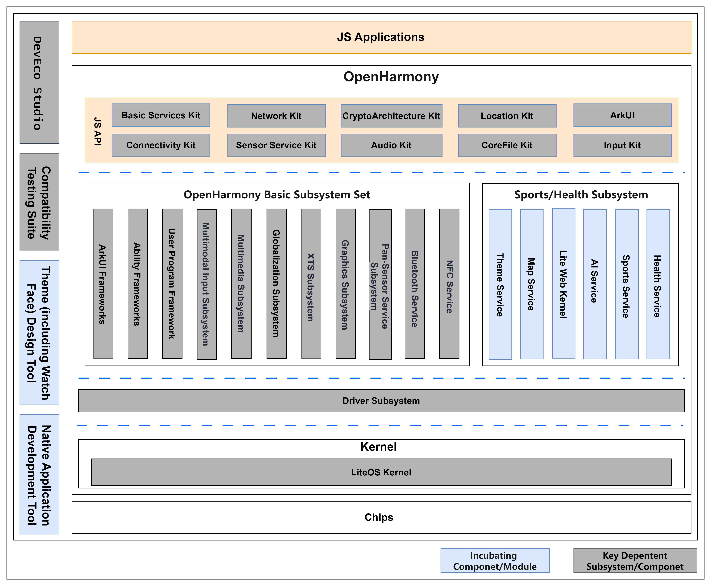

# sig_watch

English | [简体中文](./sig_watch_cn.md)

Note: The content of this SIG follows the convention described in OpenHarmony's PMC Management Charter [README](/zh/pmc.md).

## SIG architecture

## SIG group work objectives and scope

### work goals

- Complete the basic capability building for **OpenHarmony For Watch**, including:

  - Enhance system foundational capabilities to meet the development needs of applications, such as media and communication, AI, etc;
  - Complete the Watch proprietary business subsystem and proprietary supporting subsystem;
- The northbound application standard definition and application ecosystem expansion technology support for **OpenHarmony For Watch** include:

  - Define the Watch Northbound Application API and provide reference implementation;
  - Provide supporting Kit packages to support the expansion of ecological applications;
  - Define theme standards and provide theme design tool;
- The definition of the technological evolution direction of **OpenHarmony For Watch**, includes:

  - Define the direction of Watch technology evolution, including BT internet access, AI, etc;
  - Define supporting standards and reference implementations;

### work scope

Establish the **OpenHarmony For Watch** SIG group, whose main responsibilities include:

- Building basic capabilities related to **OpenHarmony for Watch**;
- **OpenHarmony For Watch**'s northbound application standard definition and application ecosystem expansion technical support;
- Definition of the technological evolution direction of **OpenHarmony For Watch**;

## SIG Members

### Leader

- [@gcw_fYKDe5oE](https://gitcode.com/gcw_fYKDe5oE)
- [@Zhangliming_star](https://gitcode.com/Zhangliming_star)
- [@llq75250858](https://gitcode.com/llq75250858)

### Committers

- [@dqiyy](https://gitcode.com/dqiyy)
- [@moyoung123](https://gitcode.com/moyoung123)
- [@AnyFont](https://gitcode.com/AnyFont)
- [@jiyong_sd](https://gitcode.com/jiyong_sd)
- [@yangxuan321](https://gitcode.com/yangxuan321)

### Meetings

- Meeting time：Quarterly meeting, first Thursday of each quarter at 3pm
- Meeting application: [sig_watch Meeting application](https://docs.qq.com/sheet/DR0llbVhjdWdMdFFt?nlc=1&tab=BB08J2)
- Meeting link：Welink or other meeting
- Meeting notification: [Subscribe to](https://lists.openatom.io/postorius/lists/dev.openharmony.io) mailing list dev@openharmony.io for the meeting link
- Meeting-Minutes: To view the minutes of past meetings, please click this [link](https://gitcode.com/openharmony/community/tree/master/sig/sig_watch/meetings)

### Contact

- Mailing list：dev@openharmony.io
- Wechat group：NA

