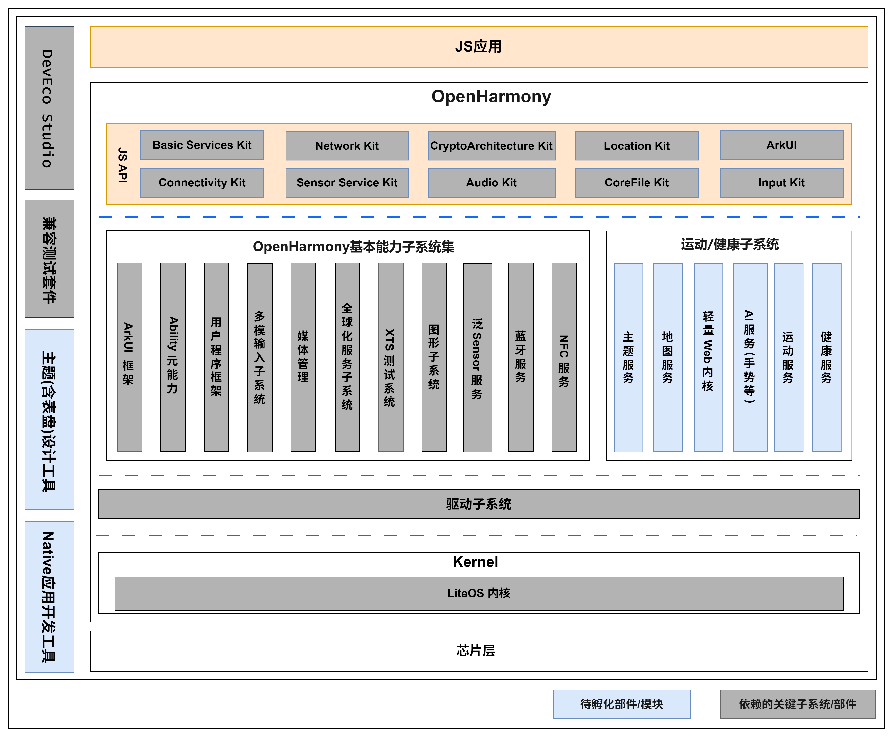

# sig_watch

简体中文 | [English](./sig_watch.md)

说明：本SIG的内容遵循OpenHarmony的PMC管理章程 [README](/zh/pmc.md)中描述的约定。

## SIG技术栈

## SIG组工作目标和范围

### 工作目标

- 完成OpenHarmony For Watch相关基础能力构建，包括：

  - 增加系统基础能力，满足北向应用开发, 如媒体，通讯， AI等；
  - 补齐Watch专有业务子系统、专有配套子系统；
- OpenHarmony For Watch的北向应用标准定义和应用生态拓展技术支撑，包括：

  - 定义Watch北向应用API标准并给出参考实现；
  - 提供配套的Kit包，支撑生态应用拓展；
  - 定义主题标准，并提供主题设计工具；
- OpenHarmony For Watch的技术演进方向定义，包括：

  - 定义Watch技术演进方向，包括BT上网，AI等;
  - 定义配套的标准和参考实现；

### 工作范围

成立OpenHarmony For Watch SIG组，SIG组主要的职责包括：

- OpenHarmony For Watch相关基础能力构建；
- OpenHarmony For Watch的北向应用标准定义和应用生态拓展技术支撑；
- OpenHarmony For Watch的技术演进方向定义;

## SIG组成员

### Leader

- [@gcw_fYKDe5oE](https://gitcode.com/gcw_fYKDe5oE)
- [@Zhangliming_star](https://gitcode.com/Zhangliming_star)
- [@llq75250858](https://gitcode.com/llq75250858)

### Committers列表

- [@dqiyy](https://gitcode.com/dqiyy)

- [@moyoung123](https://gitcode.com/moyoung123)

- [@AnyFont](https://gitcode.com/AnyFont)

- [@jiyong_sd](https://gitcode.com/jiyong_sd)

- [@yangxuan321](https://gitcode.com/yangxuan321)

### SIG组成员加入流程

1. 请发送申请邮件至`ohwatchsig@163.com`进行评审，说明单位、项目及计划等；

2. 新成员加入由SIG组长和副组长评审，通过后以邮件方式通知；

### SIG组成员要求和义务

1. 需要有商业项目，有一定规模和效果更佳；

2. 生态建设协作，如：应用拓展，共性功能开发等；

3. 参与SIG会议，讨论需求、方案、标准讨论等；

### 成员权益

1. 享有社区大会、营销等资源的优先权；
2. 享有社区支持的优先权；
3. 参与轻智能SIG长期规划；

### 会议

- 会议时间：季度例会，每个季度第一个周四下午3点
- 会议申报：[Watch_SIG例会议题申报](https://shimo.im/sheets/XKq42MbmyYfr9JAN/MODOC)
- 会议链接: Welink或其他会议
- 会议通知: 请[订阅](https://lists.openatom.io/postorius/lists/dev.openharmony.io)邮件列表 dev@openharmony.io 获取会议链接
- 会议纪要: [归档链接地址](https://gitcode.com/openharmony/community/tree/master/sig/sig_watch/meetings)

### 联系方式

- 邮件列表：dev@openharmony.io
- 微信群：暂无

