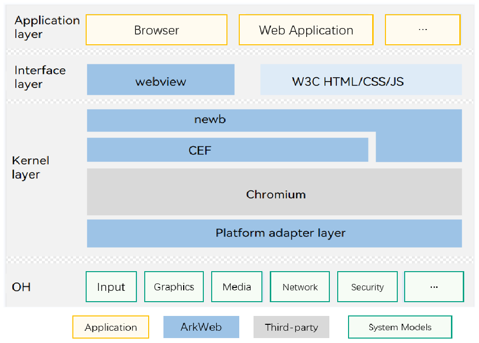

# SIG_Web
English | [简体中文](./sig_web_cn.md)

Note: The content of this SIG follows the convention described in OpenHarmony's PMC Management Charter [README](../../zh/pmc.md).

## SIG group work objectives and scope

### Work Objectives

- webview: UI component in OpenHarmony.
- nweb: native engine of the OpenHarmony web component, which is built based on the Chromium Embedded Framework (CEF).
- CEF: short for Chromium Embedded Framework, an open-source project based on Google Chromium.
- Chromium: an open-source web browser principally developed by Google and released under the BSD license and other permissive open-source licenses.

Build the web ecosystem, improve web engine compatibility. Make the web engine capable of working with various device forms of the OpenHarmony OS. Improve service capabilities and compatibility, including API definition and W3C spec
Help web engine developers and others co-works to help contribute their code to the codebase.

### Scope of work
- The web engine capability meets various service scenarios of ecosystem partners using the web.
Discuss and accept the requirements of the ecosystem for the OpenHarmony web engine, extract general compatibility solutions, meet the requirements of the ecosystem, and flourish the web ecosystem.

- Transplantation and contribution specifications
Assist ecosystem partners and web engine developers in contributing code to the community.

- Ecosystem expansion
Actively negotiate cooperation with ecosystem partners, web engine developers, and W3C standardization organizations.

## Code Repository
- Code repository address:
- ArkWeb: https://gitcode.com/openharmony-tpc/chromium_src

## SIG Members

### Leader
- @kurli(https://gitee.com/kurli)
- @mark.zhai(https://gitee.com/mark.zhai)
- @litao33(https://gitee.com/litao33)

### Committers
- @litao33(https://gitee.com/litao33)
- @mark.zhai(https://gitee.com/mark.zhai)
- @bolide74(https://gitee.com/bolide74)
- @leluyun(https://gitee.com/leluyun)
- @javayhu(https://gitee.com/javayhu)

 ### Meetings
 - Meeting time：Biweekly meeting, 10:30 a.m. Monday
 - Meeting link：[Subscribe to](https://lists.openatom.io/postorius/lists/sig_web.openharmony.io) mailing list dev@openharmony.io for the meeting link

 - Meeting time：Biweekly meeting, 10:30 a.m. Monday
 - Meeting application：[OpenHarmony sig_Web Meeting Proposal](https://shimo.im/sheets/5xkGoLr9ewSyLYkX/MODOC)
 - Meeting link: Welink
 - Meeting notification: [Subscribe to] (https://lists.openatom.io/postorius/lists/sig_web.openharmony.io) mailing list dev@openharmony.io for the meeting link
 - Meeting-Minutes: [归档链接地址](https://gitcode.com/openharmony-sig/sig-content/tree/master/web)

### Contact (optional)

- Mailing list：dev@openharmony.io
- Wechat group：
