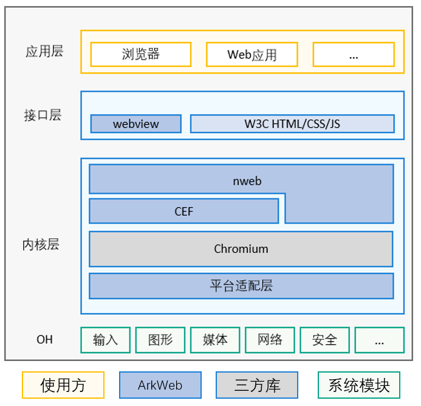

# SIG_Web
简体中文 | [English](./sig_web.md)

说明：本SIG的内容遵循OpenHarmony的PMC管理章程 [README](../../zh/pmc.md)中描述的约定。

## SIG组工作目标和范围

OpenHarmony Web 引擎架构如下:

- webview组件：OpenHarmony的UI组件。
- nweb：基于CEF构建的OpenHarmony Web组件的Native引擎，主要构建Web组件浏览器内核的部分能力。
- CEF：CEF全称Chromium Embedded Framework，是一个基于Google Chromium 的开源项目。

### 工作目标
为了完善 Web 生态，提升 Web 引擎兼容性，使之能够匹配 OpenHarmony OS 的各种设备形态，Web SIG不仅需要完善 Web 引擎的
业务能力以及兼容性，包含 API 的定义、W3C 功能的完善，更为重要的是需要扩展生态，与生态厂商、
Web 引擎开发者等进行合作，协助贡献他们的代码上库

### 工作范围
- Web 引擎能力满足生态伙伴使用 Web 的各类业务场景

讨论及接纳生态对 OpenHarmony Web 引擎的诉求，提炼通用兼容性解决方案，满足生态诉求，繁荣 Web 生态

- 移植和贡献规范

协助生态伙伴，Web 引擎开发者贡献代码到社区

- 生态拓展

积极与生态伙伴、Web 引擎开发者，W3C 标准化组织进行洽谈合作

## 代码仓
- 代码仓地址：
  - ArkWeb：https://gitcode.com/openharmony-tpc/chromium_src

## SIG组成员

### Leader
- @kurli(https://gitee.com/kurli)
- @mark.zhai(https://gitee.com/mark.zhai)
- @litao33(https://gitee.com/litao33)

### Committers列表
- @litao33(https://gitee.com/litao33)
- @mark.zhai(https://gitee.com/mark.zhai)
- @bolide74(https://gitee.com/bolide74)
- @leluyun(https://gitee.com/leluyun)
- @javayhu(https://gitee.com/javayhu)

### 会议
 - 会议时间：双周例会，上午周一10:30
 - 会议申报：[OpenHarmony sig_Web Meeting Proposal](https://shimo.im/sheets/5xkGoLr9ewSyLYkX/MODOC)
 - 会议链接: Welink
 - 会议通知: 请[订阅](https://lists.openatom.io/postorius/lists/sig_web.openharmony.io/)邮件列表 sig_web@openharmony.io 获取会议链接
 - 会议纪要: [归档链接地址](https://gitcode.com/openharmony-sig/sig-content/tree/master/web)

### 联系方式(可选)

- 邮件列表：dev@openharmony.io
- 微信群：
