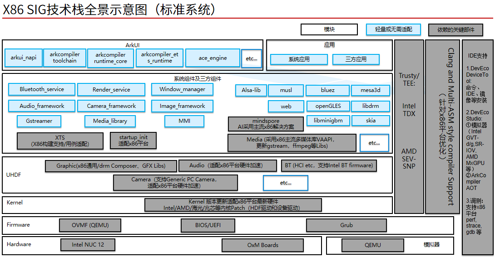

# sig_x86
简体中文 | [English](./sig_x86.md)

说明：本SIG的内容遵循OpenHarmony的PMC管理章程 [README](/zh/pmc.md)中描述的约定。

## SIG组工作目标和范围

### 工作目标

‌x86指令集以其技术成熟、扩展能力强、生态系统完善而备受青睐。将x86架构与OpenHarmony系统结合，可以带来兼容性、性能、开发灵活性、生态扩展性以及安全性和稳定性等多方面的优势。x86 SIG组旨在构建围绕x86+OpenHarmony的软硬件生态，提供适配软件包和系统构建等指导，使能x86场景下的安全等能力。x86 SIG将推动对x86+OpenHarmony感兴趣的开发者能够参与到开源系统开发活动中来。

- 使能OpenHarmony支撑X86架构与X86设备，提供X86的软件包和系统构建等指导。

- 维护对x86架构的支持。包括对x86指令集、编译、工具链、QEMU、Clang、Musl、媒体、图形、驱动、TEE、AI等适配。

- 实现x86芯片(Intel/AMD/兆芯/海光等主流芯片系列)适配OpenHarmony标准系统。

- 实现x86支持OpenHarmony的相关代码开源并上TPC，并持续维护相关适配芯片代码。

- 基于OH社区，吸纳1-2个X86芯片头部厂商，共建构建X86架构下OpenHarmony芯片适配的建设。

- 吸引2个及以上的整机/板卡厂商，拓宽OH的适配广度，丰富支持的设备生态。

- 吸纳50个以上X86方向技术专家，在社区共同共建X86+OH的底座技术。

- 吸引Top100行业软件开发企业，丰富应用生态。

### 工作范围

- 通用能力：构建OpenHarmony对x86架构的支持能力，不断更新完善关键能力，支持x86标准系统，提供安装镜像，提供动态/线上安装驱动包。对x86指令集、编译、工具链、QEMU、Clang、Musl、媒体、图形、驱动、TEE、AI等适配。对Arkruntime等支持，打通北向应用框架。

- 安全能力：将结合头部X86厂商的TEE解决方案，使能OpenHarmony在X86下的安全能力。

- 设备适配：适配主流芯片Intel core8/12代，兆芯等，2024年底前芯片适配完成代码合入TPC仓。2025以及之后陆续合入TOP厂商芯片/显卡/主要外设驱动等适配代码。支持更多设备。

- 场景扩展：新增桌面端类型，提供统一套件库管理，整合常见的用户图形界面方案、桌面端2D/3D库，提供游戏、多媒体、软件开发功能等解决方案。支持虚拟化与企业级应用场景，搭配x86技术，推动OpenHarmony系统虚拟化，容器化，应用云端化，让OpenHarmony应用在不同场景与平台上。

- 生态扩展：积极与芯片、板卡、系统、整机厂商和相关X86行业领域客户合作，推动OpenHarmony在X86环境下的应用生态建设。

技术栈全景图如下所示：

## SIG组成员

### Leader

- [boyd-ye](https://gitee.com/boyd-ye)

### Committers列表

- [pengzhaon](https://gitee.com/pengzhaon)
- [lianzhian](https://gitee.com/lianzhian)
- [hiweil](https://gitee.com/hiweil)
- [paworcn](https://gitee.com/paworcn)
- [chn9528](https://gitee.com/chn9528)
- [diemit](https://gitee.com/diemit)

### 会议
 - 会议时间：月度例会，月初第一个周四上午10:00
 - 会议链接：Welink或其他会议
 - 会议申报：[sig_x86会议申报](https://shimo.im/sheets/5bqndMnd6aiyVNAy)
 - 会议纪要：查看往期会议纪要，请点此[链接](https://gitee.com/openharmony-sig/sig-content/tree/master/x86/meetings)

### 联系方式(可选)

- 邮件列表：dev@openharmony.io
- 微信群：NA
