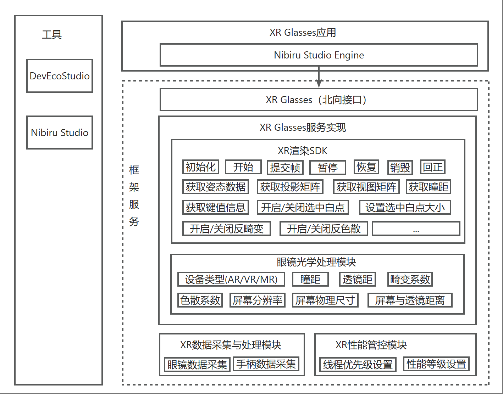

# sig_xr
English | [简体中文](./sig_xr_cn.md)

Note: The content of this SIG follows the convention described in OpenHarmony's PMC Management Charter [README](../../zh/pmc.md).

## SIG group work objectives and scope

### work goals
- Build Capabilities: Define the basic capabilities of OH XR, standardize XR API interfaces, provide developers with a unified XR subsystem and development tools to improve development efficiency; 
- Strengthen Core Competencies: Unify the OS, build an independent and controllable XR OS to ensure key XR competitiveness; 
- Promote Standards: Collaborate with leading industry players to gradually advance community-built best practices into standards, enhancing the competitiveness of the OpenHarmony community; 
- Build Ecosystem: Collaborate with hardware manufacturers and XR application developers to jointly improve industry applications and establish more application scenarios. 

### work scope
Add a dedicated business subsystem for XR glasses to provide basic capabilities for integrating virtual information with the real world.

## SIG Members

### Leader
- @xie_yujuan(https://gitcode.com/xie_yujuan)

### Committers
- @zhao_mengjiao(https://gitcode.com/zhaomengjiao)
- @tongjunyu(https://gitcode.com/tongjunyu)
- @nibirucao(https://gitcode.com/nibirucao)

### Meetings
 - Meeting time：Every other Monday, 14:10-15:10
 - Meeting application: [Issue Submission Shared Link](https://shimo.im/sheets/0l3NMM6MrnFxj7AR/MODOC)
 - Meeting link: Welink
 - Meeting notification: Email Notification
 - Meeting-Minutes: [Minutes Shared Link](https://gitcode.com/openharmony/community/tree/master/sig/sig_xr/meetings)
