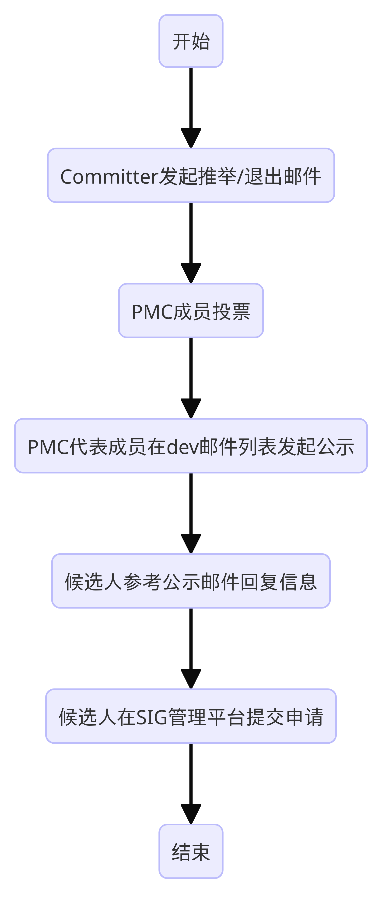

## 完整的Committer推举/退出以及添加/删除Committer权限的完整流程如下：



### 1 推举/退出Committer邮件模板：

- 邮件标题：[VOTE] New Committer Approver xxx / Inactive Committer xxx

- 邮件正文
  #### 1.1 概述：

  **推举概述示例：**
  ```
  xxx_sig组Committer gitcode_id (email address) 提名 gitcode_id (email address) 为 repository_address仓的社区Committer。
  xxx 个人贡献的简要一句话介绍。请大家回复邮件投票，赞成请回复 +1，不赞成请回复 -1 及不赞成原因。
  ```

  **退出概述示例：**
  ```
  由于工作变动，申请退出 xxx 仓库committer
  ```

  #### 1.2 贡献举证：

  - **PR 贡献**（实质代码贡献的链接）：
    - [PR 1](https://gitee.com/openharmony/window_window_manager/pulls/4404)
    - [PR 2](https://gitee.com/openharmony/window_window_manager/pulls/4272)
    - ...

  - **PR 有效检视** (参与OpenHarmony社区代码有效评论意见的链接)：
    - [Review 1](https://gitee.com/openharmony/window_window_manager/pulls/4413)
    - [Review 2](https://gitee.com/openharmony/window_window_manager/pulls/4114)
    - ...

  - **参与XXX社区推广**：
    - [文章链接](https://mp.weixin.qq.com/s/JZple12FTBVMU9To1N9ing)

  - **参与技术峰会**：
    202x年 参加 OpenHarmony开发者大会、OpenHarmony技术峰会、开放原子全球开源峰会的 **《XXX议题》**

### 2 收到公示邮件后，回复相关信息到pmc邮件列表

- 邮件标题格式：Information confirm // [New Committer] Welcoming to become committer of OpenHarmony's driver project : xxx

- 邮件正文：
```
  1. OpenHarmony Repository:
    - [Repository 1](https://gitcode.com/openharmony/ability_ability_runtime)
    - ...

  2. My name: [中文名拼音全拼/Chinese romanization]
  3. gitcode id url: [gitcode id的链接](https://gitcode.com/xxx)
  4. gitcode id associated email: [个人企业邮箱/Enterprise Email], 若是个人贡献者可以填写自己关联gitcode的个人邮箱

  ```

### 3 在SIG管理平台提交committer新增/退出申请

1. 用gitcode帐号登录仓库管理平台：[仓管理](http://ci.openharmony.cn/workbench/sig/repositoryManagement)
2. 仓路径筛选自己需要申请的仓库;
3. 在弹出的“仓信息修改”中填写：
    - **Committer列表**：输入自己的 gitcode帐号（为了社区沟通和开发者沟通，要求关联邮箱公开可获取）
    - **会议记录**：填写dev 邮件公示的会议纪要链接，例如 [会议纪要链接](https://lists.openatom.io/hyperkitty/list/dev@openharmony.io)
